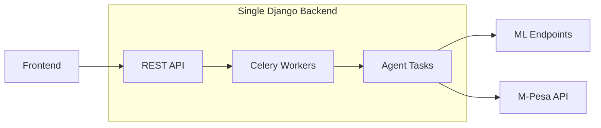
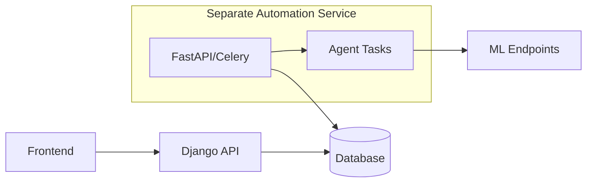
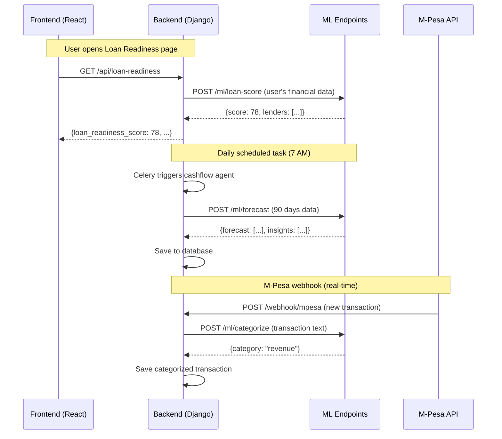

# Inua 360 - System Architecture & Team Handoff

## Team Structure

| Team | Responsibility | Deliverable |
|------|----------------|-------------|
| **You + Me** | Frontend (React) + Automations logic | Web app + automation specs |
| **Backend Dev** | Django REST API + Database | API endpoints + data models |
| **ML Team** | ML Models + Hosting | Hosted endpoints (loan scoring, forecasts, etc.) |

---

## The Big Question: Separate Automations from Backend?

### Option A: Automations INSIDE Backend (Recommended ✅)



**Pros:**
- One codebase, one deployment
- Cheaper hosting (1 server)
- Easier for backend dev to manage
- Shared database access

**Cons:**
- Backend dev needs to understand automation logic

---

### Option B: Automations SEPARATE from Backend



**Pros:**
- Clear separation of concerns
- You control automations directly
- Can use different tech (Python/FastAPI)

**Cons:**
- Two deployments to manage
- Need to sync database access
- More complex

---

## My Recommendation

> [!IMPORTANT]
> **Go with Option A (automations inside backend)** but with clear separation in code.

The backend dev builds the API + database + Celery setup. You define the automation **logic** (schedules, what each agent does). They implement it.

---

## How It All Connects



---

## What Backend Dev Needs to Build

### 1. Database Models

```
User
  - id, phone, email, name

Business
  - id, user_id, name, sector, county, revenue

Transaction (M-Pesa)
  - id, business_id, amount, type, category, timestamp

ComplianceItem
  - id, business_id, type, status, expiry_date

LoanReadinessReport
  - id, business_id, score, created_at, data (JSON)

CashFlowForecast
  - id, business_id, period_days, data (JSON)
```

### 2. API Endpoints

| Endpoint | Method | Purpose |
|----------|--------|---------|
| `/api/loan-readiness` | GET | Fetch latest loan readiness score |
| `/api/compliance` | GET | List all compliance items |
| `/api/transactions` | GET | List M-Pesa transactions |
| `/api/cashflow/forecast` | GET | Get 21/90-day forecast |
| `/webhook/mpesa` | POST | Receive M-Pesa callbacks |

### 3. Celery Tasks (Automations)

| Task | Schedule | What It Does |
|------|----------|--------------|
| `check_compliance_expiry` | Daily 8 AM | Check licenses expiring in 30 days |
| `generate_cashflow_forecast` | Daily 7 AM | Call ML, save forecast |
| `calculate_loan_readiness` | Weekly Mon 8 AM | Call ML, save score |
| `match_funding_opportunities` | Weekly Mon 9 AM | Match profile to funds |

---

## Agent Build Order (Priority)

Build agents in this order based on dependencies and value:

| Priority | Agent | Why This Order |
|----------|-------|----------------|
| **1** | 🛡️ Compliance Tracker | Simplest. No ML needed. Just date checks. Proves Celery works. |
| **2** | 📱 Financials Agent | Foundation. M-Pesa webhook + transaction storage. All other agents need this data. |
| **3** | 📈 Cash-Flow Forecaster | Needs transaction data from #2. First ML integration (Prophet). |
| **4** | 💰 Loan Readiness | Needs transactions + compliance data. Uses ML loan scoring. |
| **5** | 🎯 Funding Navigator | Needs loan readiness score. Simple matching logic. |
| **6** | 🧱 Profile Builder | Aggregates everything. Mostly read-only from other agents. |
| **7** | 🤖 Supervisor | Orchestrator. Built last after all agents work individually. |

### Dependency Chain

```
Financials (M-Pesa) 
    ↓
Cash-Flow Forecaster ──→ Loan Readiness ──→ Funding Navigator
    ↓                         ↓
Compliance Tracker      Profile Builder
                              ↓
                        Supervisor
```

---

## How ML Endpoints Will Be Called

Backend dev just needs to know the ML team's endpoint format:

```python
# Example: Calling ML loan scoring endpoint
import requests

ML_BASE_URL = "https://ml.inua360.co.ke"  # ML team provides this

def get_loan_score(business_data):
    response = requests.post(
        f"{ML_BASE_URL}/loan-score",
        json={
            "revenue_data": business_data["revenue_history"],
            "expense_data": business_data["expense_history"],
            "compliance_score": business_data["compliance_score"],
            "existing_debt": business_data["total_debt"]
        }
    )
    return response.json()  # {score: 78, lenders: [...]}
```

**ML team provides:**
1. Base URL of their hosted service
2. Request/response format documentation
3. API key if needed

**Backend dev:**
- Stores ML_BASE_URL in environment variables
- Calls ML endpoints when needed (on schedule or on-demand)
- Handles errors gracefully

---

## Questions for You

1. **Should I create a detailed Backend Spec document** that the backend dev can follow?

2. **Do you want me to specify the exact Celery task logic** (pseudocode) for each agent?

3. **Should automations run on a schedule only, or also on-demand** (e.g., user clicks "Refresh Score")?
